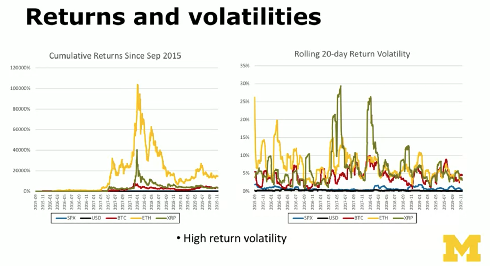
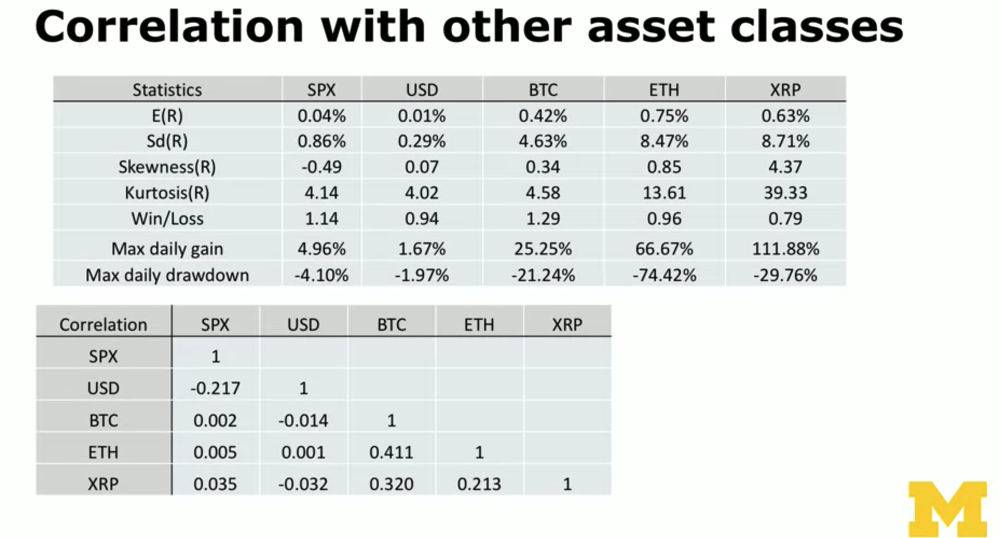
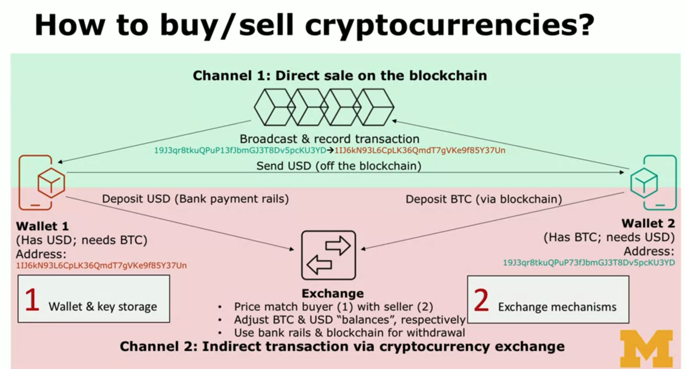
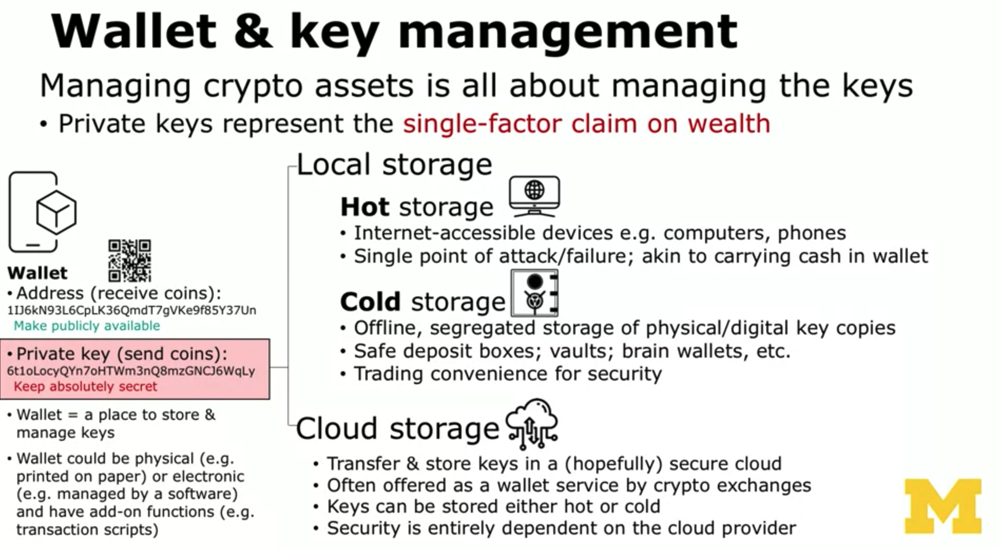
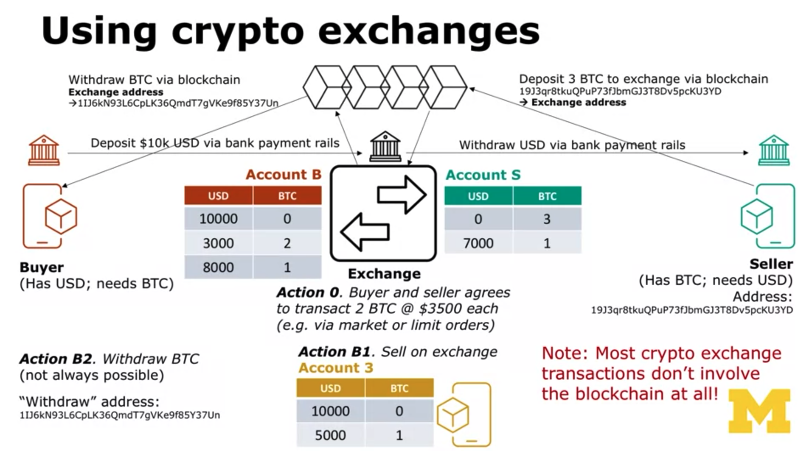

## Blockchain Consensus: What is it and Why do We need it?

* Consensus mechanism in blockchains
    * Two limitations appear once a system becomes decentralized
        * 1 - Assume all nodes are honest
            * Different nodes might receive different information
                * Transactions are not propagated to all nodes at the same time due to network latency
                * Each node has its own timestamp
        * At any points in time, different nodes will have different data records
            * Need to make sure all network nodes have the same information
        * 2 - Some of nodes might be outright malicious
            * No restricition on becoming a node in public blockchains
            * Bad nodes might broadcast bad information hoping to make it on the chain
        * These two limitations constitute the **Byzantine generals problem**
    * So consensus is:
        * An algorithmic process to ensure that there exists only a single copy of record shared by all nodes
        * But consensus does NOT:
            * Guarantee that the single data copy is more true/secure/unadulterated than centralized conterparts

## Blockchain Consensus: Generic Consensus Models

## Blockchain as an asset: Overview of the Cryptocurrency Market

* Overview
    * Bitcoin and particularly Ethereum have led to an explosion of publicly traded crypto coins & tokens
        * 5000 + publicly-traded coins/tokens
            * Total market cap of all crypto assets tracked by coinmarketcap:
                * Early 2016: $7 billion
                * Peak of bitcoin hype: $830 billion
                * End of 2019: $230 billion
            * The market is highly concentrated
                * Over 80% of the market cap concentrated in BTC, ETH, XRP
        * Often mistakenly labeled as "cryptocurrencies"even though most are not designed or used as currencies

* Kurtosis - Measures how fat-tailed the return distributions are.

## Buying and Selling Cryptocurrencies: Overview; Wallet & Key Storage

* How to buy/sell cryptocurrencies?
    * Suppose you want to buy some bitcoin

* Wallet & Key Management
    * Managing crypto assets is all about managing the keys
        * Private keys represent the **single-factor claim on wealth**

* Wallet = a place to store & manage keys
* Wallet could be physical (e.g. printed on paper) or electronic (e.g. managed by a software) and have add-on functions (e.g. transaction scripts)

* Key Management: Best practices
    * Manage your keys almost exactly like managing your cash
    * Don't carry bills in huge denominations
        * Use a new key pair for each transaction
    * Don't put your entire wealth in your wallet
        * Carry only small amount of "daily spend" in hot storage
        * The bulk of the wealth should be in cold storage
    * Vet "cash deposit box" services carefully
        * Storing keys in the cloud = putting complete trust in their security practices

## Buying and selling cryptocurrencies: Using crypto exchanges

* Using crypto exchanges

* Crypto exchange is similar to a hybrid of:
    * 1 - Bank
        * It holds custody of both fiat & crypto assets
        * Account balances represent promises to repay
    * 2 - Brokerage firm
        * It generates buy/sell orders on behalf of clients
    * 3 - Stock exchange
        * It matches buyers with sellers using different order types

## Key crypto riks factors: Exchange risks

* Introduction
    * Assess the risks of the cryptocurrency "asset class" in the following aspects:
        * 1 - Exchange
        * 2 - Consumer utility
        * 3 - Coin supply
        * 4 - Cybersecurity
        * 5 - Cnetralization
        * 6 - Investor sentiment

* Exchange risks: Custodian risk
    * Crypto exchanges are different from stock exchanges in that they **hold custody of clients crypto & fiat assets**
        * Users need to transfer fiat & crypto to the exchange before they can begin trading
        * On stock exchanges, by constrast, brokerages employ thrid-party custodian banks to hold custody of stocks in clients' name
        * -> Crypto exchanges combine exchange & custodian-bank functions
    
    * The "account balances" are merely promises that the crypto/fiat money will be available for withdrawal
    * The custodian functions of crypto exchanges are mostly unregulated, thus open to multiple types of risks:
        * "Ponzi schemes" & fake exchanges (e.g. Bitconnect)
            * The crypto exchange could be operated by scammers
            * All transferred crypto assets would be irreversibly lost
        * "Bank runs"
            * Potentially severe liquidity problem if many users demand withdraw at the same time

* Exchange risks: Liquidity risk
    * Regulated exchanges have dedicated **market makers**
        * Specialist or HFT firms that stand ready to take the other side of demand
            * They post bid-ask prices & provide liquidity

    * Cryptocurrency exchanges have much fewer professional market makers
        * High inventory costs due to high price volatility
    
    * -> Easier from everyone to run for the door at the same time
        * High spreads, low liquidity, extreme price movements
        * Liquidity would be lowest precisely when most needed
    
    * Most regular exchanges have circuit breakers
        * Tradinhg halted when intraday return is below a threshold -> Dampens panic selling
        * None for crypto exchanges -> Exacerbates panic selling

* Exchange risks: Price manipulation
    * The unregulated nature of crypto trading suggests significant degree of price manipulation
    * Gandal et al. (JME 2018): Bot manipulation on Mt. Gox
    * Suspects: "Markus" and "Willy" bots
        * "Buying" activities corresponded to price hikes
        * Rapidly "buy" exactly 2.5 million USD per account; deactivate; repeat
        * "Credited" with coins that were never exchanged
        * No other, legitimate customers received any coin from them
        * Confirmed to be operated by Mt. Gox

## Key Crypto Risk Factors: Supply, Cyversecurity, and Centralization

* "Limited" coin supply
    * Popular investor belief: **Limited total supply -> price floor**
        * Blockchain-based cryptocurrencies are public **networks**
            * Nodes/miners have complete freedom to choose (1) whether to participate and (2) which blockchain to support
        * Almost zero cost to create identical coins
            * Simply copy the open-sourced code & get nodes to install it
        * -> Total supply as a whole likely to be unlimited
            * -> No price floor exists -> Many cap-limited coins can still go to zero

* Cybersecurity risks
    * Many investors confuse data **integrity** with data **security**
        * Blockchain data structure has no single point of failure
            * Data stored on multiple nodes similar to data centers; mostly immutable
        * No safeguard preventing the entry of fraudulent data
        * Blockchain networks has many points of **attack**:
            * Private keys represent the single factor of authentication
                * Users are responsible for their own security
            * Exchanges often lack the security infrastructure of traditional financial institutions -> Easy targets for hacking
                * Over 40 documented attacks since 2011
            * Open-source protocols can be abused (e.g. the DAO hack) 

* Centralization & supply chain risks
    * Most crypto blockchain networks are not "decentralized"
        * Mining nodes are highly concentrated
            * Easier coordination of DoS/consensus attack
            * Concentrated effect of government regulation
    * Production of mining equipment is highly concentrated
        * Risks of hardware-embedded malicious codes and coordinated cyberattcks on other IT infrastructure.

## Crypto Risk Factors: Utility and Sentiment

* Consumer utility
    * Difficult to value most cryptocurrencies seem based on consumer usage & utility (e.g., in payments)
        * Low throughput and inefficient record-keeping
            * -> Low scalability
        * High volatility relative to fiat
            * -> Users are not incentivized to keep them for daily spending
        * Irreversible transactions
            * -> No consumer protection & fraud intermediation policies
    * Poor crypto adoption by mainstream retailers
        * Mostly relegated to transactions that require high (or total) anonymity
        * E.g. off-the-exchange, directly-on-the-blockchain to avoid KYC
            * Circumventing capital control; dark-web-transactions; ransomware

* Investor sentiment in crypto markets
    * Consumer utility cannot explain crypto's dramatic movements
    * Significant fraction of "bandwagon investors" (Buffet, 2012)
        * Belief that the asset price will keep going up
            * Dot-com stocks, early-2000 housing prices, tulip bulbs, ...
        * Belief that asset has a truly limited supply
            * Jump on the bandwage -- "Better get in before it's too late!"
        * Attributable to herding & confirmation biases

* Future outlook: uncertain
    * Forecasting sentiment is difficult
        * Both consumer & investor sentiments are quite volatile
    * Large volatilities will be a key issue to address
        * Asset-backed crypto pegged to (1) fiat currencies, (2) other crypto, and even (3) commodities ("Stablecoins")
        * Government-issued paper currency replacements ("Fedcoins")
    * There will be more regulations
        * Further classification of crypto as securities vs. commodities
    * We need crypto/blockchain projects that have real consumer utility & business users